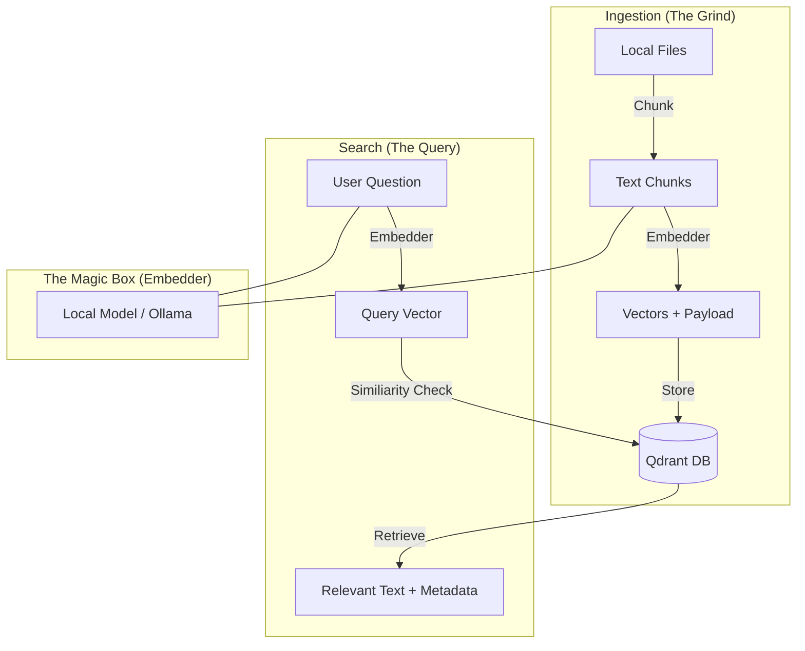

# Technical Overview: How it Works

> **Mission**: Demystify the "black box" of vector search and explain the resilience of the system.

---

## 1. The Core Lifecycle

The system operates in two distinct phases: **Ingestion** (Writing) and **Search** (Reading).

### Ingestion vs. Search Flow

---

## 2. Your Questions Answered

### "If I delete the source file, am I screwed?"
**No.** 
When we ingest a file, we don't just store a pointer to the file; we store the **Payload**. The payload contains:
1.  **The actual text content** of that chunk.
2.  **The metadata** (filename, line numbers, git commit SHA).

Because the text itself is stored inside Qdrant, the system is highly resilient. If you delete the file on your disk, the information remains searchable and readable in the database.

> [!NOTE]
> Re-ingesting a folder after deleting a file will not automatically "delete" it from the DB unless you explicitly call `delete_collection` or we implement a "Sync/Prune" mode in the future.

### "If I lose access to Ollama, am I screwed?"
**Yes, for both Reading and Writing.**
Semantic search isn't just a keyword lookup; it's a "math lookup." 
- To **Ingest**: You need the embedder to turn text into numbers.
- To **Search**: You need the embedder to turn your *question* into the same "math space" as the database.
If Ollama (or your local embedder) is down, the system cannot translate your question into a vector, and search will fail.

### "Why is it so fast? Are you pulling files from external places?"
Search is nearly instantaneous for two reasons:
1.  **Vector Indexing (HNSW)**: Qdrant doesn't scan every item. It uses a specialized graph (HNSW) to "hop" towards the most similar vectors in logarithmic time.
2.  **Payload Inclusion**: We store the text *inside* the database. We never touch the disk during a search result return. We pull the text and the vector from RAM/NVMe direct from Qdrant.

### "What is a 'Faceted' Database?"
Standard vector search finds things that are "semantically similar" (e.g., searching for "login" finds "authentication"). 

A **Faceted** approach adds filters to that search. In `vecdb-mcp`, every chunk is "faceted" by:
- `collection` (The high-level bucket)
- `path` (The specific file)
- `commit_sha` (The specific version)

This allows you to say: *"Search for 'authentication' but ONLY in the v1.0.0 collection."* Qdrant handles this via pre-filtering, making it just as fast as a raw search.

### Smart Routing (Deterministic Facet Discovery)

> **Deep Dive**: Read [VECTOR_FACETS.md](VECTOR_FACETS.md) for a complete guide on Facets, Embeddings, and Configuration.

Querying a vector database can suffer from "Embedding Dilution"—where a search query like *"How to install on Ubuntu"* returns generic results because the concept of "Install" overpowers the specific constraint of "Ubuntu".

`vecdb` solves this with **Smart Routing**. 

Instead of relying solely on vector similarity, the `DynamicRouter` acts as a deterministic filter engine:
1.  **Configurable Monitoring**: It monitors specific metadata fields you define in `config.toml` (e.g., `language`, `source_type`, `platform`).
2.  **Auto-Discovery**: It learns what valid values exist in your database (e.g., it sees you have `platform=linux`).
3.  **Hard Filtering**: When you search for "linux installation", it detects the "linux" keyword and applies a **Hard Filter** before searching.

This ensures that searched results strictly respect the constraints you asked for, providing the precision of SQL with the semantic power of vectors.

## 3. Resource Management & Stability

### Thread Capping (The "Meltdown Preventer")
Vector math libraries (ONNX Runtime, Torch, Intel MKL) are notorious for trying to grab **all available CPU cores** for every operation. In a concurrent environment (like an MCP server handling multiple requests), this causes "Thread Starvation" and system lag.

`vecdb` aggressively manages this by detecting your CPU count and forcing these libraries to stay in their lane.
*   **Automatic Cap**: defaults to `(NumCPUs / 2).clamp(1, 4)` threads per operation.
*   **Overrides**: You can manually set `ORT_INTRA_OP_NUM_THREADS` env var if you need raw performance for a single-user batch job.

### Memory Safety (Rust)
The entire codebase is written in Rust, which guarantees memory safety without a garbage collector. This is critical for `ingest`, which might process gigabytes of text. We use streaming iterators and buffered readers to keep RAM usage constant regardless of dataset size.

---

## 4. Summary Table

| Scope | Dependency | If Lost... |
|-------|------------|------------|
| **Storing Data** | Embedder + Qdrant | Cannot add new knowledge. |
| **Searching Data** | Embedder + Qdrant | Cannot query existing knowledge. |
| **Source Files** | None (Post-Ingest) | Search results still return full text. |

---
*"Knowledge is captured in vectors. Insight is retrieved through math."*
