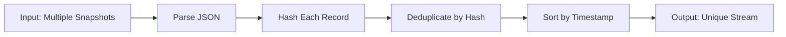
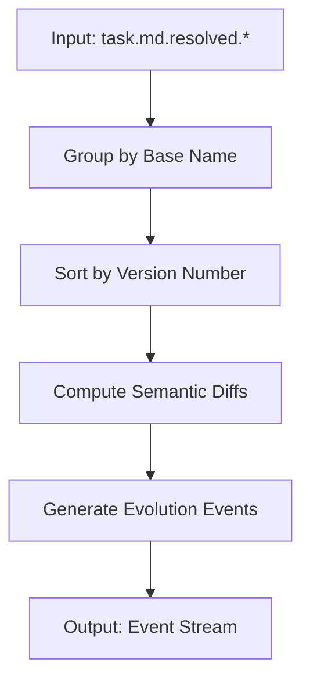

# vecdb-asm: Knowledge Assembly Strategies

> **Developer Guide to Understanding and Using `vecdb-asm`**

## Table of Contents
1. [Introduction: The Problem](#introduction-the-problem)
2. [The Two Strategies](#the-two-strategies)
3. [Strategy 1: Stream Consolidation](#strategy-1-stream-consolidation)
4. [Strategy 2: State Reduction](#strategy-2-state-reduction)
5. [Practical Walkthroughs](#practical-walkthroughs)
6. [CLI Reference](#cli-reference)

---

## Introduction: The Problem

### What Are We Solving?

Imagine you're building an AI agent that learns from its work. The agent creates lots of files:
- Conversation logs
- Task lists that get updated
- Implementation plans that evolve
- Code snippets
- Research notes

**The Challenge**: How do you make this data searchable and useful *over time*?

You could just dump everything into a vector database, but you'd end up with:
- **Massive duplication** (same log entry indexed 100 times)
- **Obsolete information** (old versions of task lists mixed with current ones)
- **No sense of evolution** (can't tell *how* a plan changed, just what it is now)

**`vecdb-asm`** (Vector Database Assembler) solves this by understanding *two different types of knowledge*:
1. **Streams** - things that accumulate over time (logs, conversations)
2. **States** - things that evolve through versions (documents, plans, code)

---

## The Two Strategies

Think of knowledge like water:

### Stream Consolidation (for Flowing Data)
Like a river that keeps flowing. Each new drop of water is unique, but you don't want to sample the same section of river over and over.

**Use for**: Logs, conversations, append-only data

### State Reduction (for Evolving Documents)
Like taking snapshots of a sculpture as the artist carves it. You don't care about the final sculpture alone—you want to know *how it changed* to understand the artist's thinking.

**Use for**: Task lists, plans, code files, any document with versions

---

## Strategy 1: Stream Consolidation

### The Theory

**Problem**: You have a conversation log that grows continuously. Every time you snapshot it, 99% of the content is duplicated from the last snapshot.

```
snapshot_1.txt: [A, B, C]
snapshot_2.txt: [A, B, C, D, E]  ← contains A, B, C again!
snapshot_3.txt: [A, B, C, D, E, F, G]  ← contains everything again!
```

If you index all three snapshots, you'll embed A, B, and C three times each—wasting computation and polluting search results.

**Solution**: Hash each record, keep only new ones, and sort by timestamp.

### How It Works (Technical)



**Step by step**:

1. **Read all snapshots** as JSON arrays
2. **Hash each record** using SHA-256 of its content
3. **Track seen hashes** in memory
4. **Skip duplicates** - if we've seen this hash before, ignore it
5. **Sort by timestamp** - ensure chronological order
6. **Output clean stream** - only unique, ordered records

### Concrete Example

**Input File 1** (`conversation_v1.json`):
```json
[
  {"speaker": "User", "text": "Hello", "timestamp": "2026-01-01T10:00:00Z"},
  {"speaker": "Agent", "text": "Hi!", "timestamp": "2026-01-01T10:00:05Z"}
]
```

**Input File 2** (`conversation_v2.json`):
```json
[
  {"speaker": "User", "text": "Hello", "timestamp": "2026-01-01T10:00:00Z"},
  {"speaker": "Agent", "text": "Hi!", "timestamp": "2026-01-01T10:00:05Z"},
  {"speaker": "User", "text": "How are you?", "timestamp": "2026-01-01T10:01:00Z"}
]
```

**Command**:
```bash
vecq --slurp conversation_v1.json conversation_v2.json | \
  vecdb-asm --strategy stream
```

**Output** (deduplicated):
```json
[
  {"speaker": "User", "text": "Hello", "timestamp": "2026-01-01T10:00:00Z"},
  {"speaker": "Agent", "text": "Hi!", "timestamp": "2026-01-01T10:00:05Z"},
  {"speaker": "User", "text": "How are you?", "timestamp": "2026-01-01T10:01:00Z"}
]
```

Notice: The first two records appear only ONCE, even though they existed in both files.

### When to Use Stream Consolidation

✅ **Good for**:
- Chat logs
- Event streams
- Append-only databases
- Any data where newer snapshots contain all old data plus new entries

❌ **Not good for**:
- Files that get edited (use State Reduction instead)
- Files where you need to track changes, not just accumulate

---

## Strategy 2: State Reduction

### The Theory

**Problem**: You have a task list that evolves over time:

```
task.md.resolved.0:
- [ ] Design API
- [ ] Write code

task.md.resolved.1:
- [x] Design API
- [/] Write code
  - [x] Models
  - [ ] Controllers

task.md.resolved.2:
- [x] Design API
- [x] Write code
  - [x] Models
  - [x] Controllers
- [ ] Write tests
```

Each version is a snapshot of the *current state*. But what you really want to know is:
- **What changed between versions?**
- **Why did it change?**
- **What was the thinking process?**

Simply indexing the final version loses the narrative. Indexing all versions creates confusion about which is current.

**Solution**: Track the *evolution* by computing semantic diffs and creating "Events" that describe changes.

### How It Works (Technical)



**Step by step**:

1. **Scan input** for files matching pattern `*.resolved.N`
2. **Group by artifact** - `task.md.resolved.0`, `task.md.resolved.1` → group "task.md"
3. **Sort by version** - ensure `.0` before `.1` before `.2`
4. **Read file content** from disk (not just metadata)
5. **Compute diffs** between consecutive versions using semantic diffing (not line-by-line)
6. **Emit events**:
   - **Create event** for version 0
   - **Modify events** for versions 1, 2, ... showing deltas

### What's a "Semantic Diff"?

Unlike traditional line-by-line `diff`, semantic diffing understands structure:

**Line-diff** would show:
```diff
- - [ ] Write code
+ - [x] Write code
```

**Semantic diff** shows:
```
Changed: Task "Write code" status: incomplete → in-progress
Added: Subtask "Models"
Added: Subtask "Controllers"
```

This is **way more useful** for an AI to understand what actually changed conceptually.

### Concrete Example

**File Structure**:
```
brain/
  task.md.resolved.0
  task.md.resolved.1
  task.md.resolved.2
```

**Content**:

`task.md.resolved.0`:
```markdown
# Tasks
- [ ] Step 1: Research
- [ ] Step 2: Implement
```

`task.md.resolved.1`:
```markdown
# Tasks
- [x] Step 1: Research
- [/] Step 2: Implement
  - [x] Part A
  - [ ] Part B
```

`task.md.resolved.2`:
```markdown
# Tasks
- [x] Step 1: Research
- [x] Step 2: Implement
  - [x] Part A
  - [x] Part B
- [ ] Step 3: Test
```

**Command**:
```bash
find brain/ -name "task.md.resolved.*" | \
  vecq --slurp | \
  vecdb-asm --strategy state
```

**Output** (Evolution Events):
```json
[
  {
    "event": "Create",
    "artifact_id": "task.md",
    "version": 0,
    "timestamp": "2026-01-08T10:00:00Z",
    "full_content": "# Tasks\n- [ ] Step 1: Research\n- [ ] Step 2: Implement"
  },
  {
    "event": "Modify",
    "artifact_id": "task.md",
    "version": 1,
    "timestamp": "2026-01-08T11:00:00Z",
    "diff": {
      "added": "  - [x] Part A\n  - [ ] Part B",
      "removed": "",
      "modified": "- [ ] Step 2: Implement → - [/] Step 2: Implement"
    },
    "summary": "Marked Step 1 complete, started Step 2, added subtasks"
  },
  {
    "event": "Modify",
    "artifact_id": "task.md",
    "version": 2,
    "timestamp": "2026-01-08T12:00:00Z",
    "diff": {
      "added": "- [ ] Step 3: Test",
      "removed": "",
      "modified": "All subtasks of Step 2 completed"
    },
    "summary": "Completed Step 2, added Step 3"
  }
]
```

### Why This Matters

When you search the `brain_state` collection for "When did we add testing?", the vector database can find:
```
Event: Modify, version 2
Summary: "Completed Step 2, added Step 3"
Added: "- [ ] Step 3: Test"
```

You get **context** about not just *what* exists, but *when* and *why* it was added.

### When to Use State Reduction

✅ **Good for**:
- Task lists (`task.md`)
- Implementation plans (`implementation_plan.md`)
- Configuration files
- Any document with versioned snapshots

❌ **Not good for**:
- Rapidly changing logs (use Stream Consolidation)
- Binary files (no semantic diff available)

---

## Practical Walkthroughs

### Walkthrough 1: Setting Up Brain Sync for an Agent

**Scenario**: You have an AI agent that creates artifacts in `.gemini/brain/`. You want to index its knowledge.

**Step 1: Identify Your Data Types**

Look at your brain directory:
```bash
ls ~/.gemini/brain/
```

You see:
- `conversation_history.json` (append-only log)
- `task.md.resolved.0`, `task.md.resolved.1`, ... (versioned docs)
- `notes.md.resolved.0`, `notes.md.resolved.1`, ... (versioned docs)

**Conclusion**: You need BOTH strategies.

**Step 2: Set Up Stream Consolidation**

Create `sync_conversation.sh`:
```bash
#!/bin/bash
find ~/.gemini/brain/ -name "conversation_history.json*" | \
  vecq --slurp | \
  vecdb-asm --strategy stream | \
  vecdb ingest - -c brain_conversation
```

This will:
1. Find all conversation snapshots
2. Merge them into one JSON array
3. Deduplicate by hash
4. Ingest into `brain_conversation` collection

**Step 3: Set Up State Reduction**

Create `sync_artifacts.sh`:
```bash
#!/bin/bash
find ~/.gemini/brain/ -name "*.resolved.*" | \
  vecq --slurp | \
  vecdb-asm --strategy state | \
  vecdb ingest - -c brain_state
```

This will:
1. Find all `.resolved.N` snapshots
2. Group by artifact name
3. Calculate evolution diffs
4. Ingest events into `brain_state` collection

**Step 4: Automate with Cron**

```bash
# Edit crontab
crontab -e

# Add these lines:
*/15 * * * * /path/to/sync_conversation.sh
*/15 * * * * /path/to/sync_artifacts.sh
```

Now your agent's knowledge updates every 15 minutes automatically!

**Step 5: Query the Knowledge**

```bash
# Find conversation about a topic
vecdb search "authentication implementation" -c brain_conversation

# Find when a task was added
vecdb search "When was testing added?" -c brain_state
```

---

### Walkthrough 2: Debugging "Why Isn't My Data Showing Up?"

**Problem**: You ran the sync script, but search returns nothing.

**Debug Step 1: Check Collection Exists**
```bash
vecdb list
```

Look for your collection name. If it's missing, ingestion failed.

**Debug Step 2: Run Pipeline Manually**

Break the pipeline into stages:

```bash
# Stage 1: Gather files
find ~/.gemini/brain/ -name "*.resolved.*" > /tmp/files.txt
cat /tmp/files.txt  # Should show your files

# Stage 2: Slurp
vecq --slurp $(cat /tmp/files.txt) > /tmp/slurped.json
cat /tmp/slurped.json | jq length  # Should show array length

# Stage 3: Assemble
vecdb-asm --strategy state /tmp/slurped.json > /tmp/events.json
cat /tmp/events.json | jq length  # Should show event count

# Stage 4: Ingest
vecdb ingest /tmp/events.json -c brain_state
```

**Common Issues**:

| Symptom | Cause | Fix |
|---------|-------|-----|
| Stage 1 returns nothing | Wrong file pattern | Check filename extensions |
| Stage 2 produces `[]` | Files aren't valid JSON | Use `vecq` on individual files to test |
| Stage 3 produces `[]` | No version suffixes found | Ensure files named `*.resolved.0`, etc. |
| Stage 4 hangs | Embedding model offline | Check `vecdb` config, try `--embedder local` |

---

### Walkthrough 3: Understanding the Output

**Question**: "What exactly is `vecdb-asm` outputting?"

**Answer**: It depends on the strategy.

#### Stream Strategy Output

**Input**:
```json
[
  {"id": 1, "content": "A", "time": 100},
  {"id": 2, "content": "B", "time": 200},
  {"id": 1, "content": "A", "time": 100}  // duplicate
]
```

**Output**:
```json
[
  {"id": 1, "content": "A", "time": 100},
  {"id": 2, "content": "B", "time": 200}
]
```

It's just a cleaned, deduplicated, sorted JSON array. The records themselves are unchanged—we just removed duplication.

#### State Strategy Output

**Input**: Multiple files grouped by name and version

**Output**: Evolution events (new JSON structure)
```json
[
  {
    "event": "Create",
    "artifact_id": "plan.md",
    "version": 0,
    "timestamp": "...",
    "full_content": "..."
  },
  {
    "event": "Modify",
    "artifact_id": "plan.md", 
    "version": 1,
    "timestamp": "...",
    "diff": {
      "added": "New section about testing",
      "removed": "",
      "modified": "Updated implementation approach"
    },
    "full_content": "..."
  }
]
```

**Key difference**: State strategy **transforms** the data into a new structure (events), while stream strategy just **cleans** the existing structure.

---

## CLI Reference

### Basic Usage

```bash
vecdb-asm --strategy <STRATEGY> [INPUT]
```

**Arguments**:
- `--strategy <STRATEGY>`: Required. Either `stream` or `state`
- `[INPUT]`: Optional path to JSON file. Defaults to stdin.

### Flags (Stream Strategy)

- `--no-dedupe`: Disable deduplication (keep all records, even duplicates)

### Examples

**Stream from stdin**:
```bash
cat logs/*.json | vecq --slurp | vecdb-asm --strategy stream
```

**Stream from file**:
```bash
vecdb-asm --strategy stream /tmp/consolidated.json
```

**State from pipe**:
```bash
find . -name "*.resolved.*" | vecq --slurp | vecdb-asm --strategy state
```

**Disable deduplication** (for debugging):
```bash
vecdb-asm --strategy stream --no-dedupe input.json
```

---

## Advanced Topics

### Custom Timestamp Extraction

By default, `vecdb-asm` looks for fields named `timestamp`, `time`, `created_at`, etc.

If your data uses a different field:
```json
{"msg": "hello", "when": "2026-01-08T10:00:00Z"}
```

You'll need to preprocess:
```bash
cat data.json | jq 'map(.timestamp = .when)' | vecdb-asm --strategy stream
```

### Handling Large Datasets

For millions of records, consider:

1. **Streaming mode**: Process in chunks rather than loading everything into memory
2. **Incremental sync**: Track last sync time, only process new files
3. **Parallel ingestion**: Split data, run multiple `vecdb ingest` processes

Example incremental sync:
```bash
# Save last sync timestamp
LAST_SYNC=$(cat ~/.vecdb_last_sync 2>/dev/null || echo "1970-01-01")

# Find only new/modified files
find ~/.gemini/brain/ -name "*.resolved.*" -newermt "$LAST_SYNC" | \
  vecq --slurp | \
  vecdb-asm --strategy state | \
  vecdb ingest - -c brain_state

# Update timestamp
date -Iseconds > ~/.vecdb_last_sync
```

---

## Theory Deep Dive: Why Vector Databases?

**Traditional Search** (like `grep`): Finds exact matches
```bash
grep "authentication" *.md
```
✅ Fast for known terms  
❌ Misses synonyms, related concepts

**Vector Search**: Finds semantic similarity
```bash
vecdb search "authentication implementation" -c brain_state
```
✅ Finds "login system", "auth flow", "credential validation"  
✅ Understands context and meaning  
❌ Requires embedding computation

**Why Assembly Matters**:

Raw data → Vector DB = Information overload
- 1000 duplicate log entries
- Conflicting versions of truth
- No temporal context

Assembled data → Vector DB = Knowledge
- Unique, relevant records
- Clear evolution narrative  
- Temporal understanding

---

## FAQ

**Q: Can I use both strategies on the same files?**  
A: No. Each file should use one strategy based on its nature. Logs → stream. Versioned docs → state.

**Q: What if my files don't have `.resolved.N` suffixes?**  
A: State strategy requires this naming. Rename files or add versioning to your snapshot process.

**Q: Does this work with databases other than Qdrant?**  
A: Yes, as long as `vecdb` CLI supports it. `vecdb-asm` just outputs JSON—the ingestion layer handles the DB.

**Q: Can I customize the diff algorithm?**  
A: Currently uses the `similar` crate's default. Future versions may add options for different diff strategies.

**Q: What about binary files?**  
A: State strategy only works on text. For binary versioning, consider metadata-based approaches.

---

## Summary

**Stream Consolidation**: For data that accumulates (logs, conversations)
- Deduplicates by content hash
- Sorts chronologically  
- Preserves original structure

**State Reduction**: For data that evolves (documents, code)
- Groups by artifact name
- Computes semantic diffs
- Emits evolution events

**Together**: They give your AI agent perfect memory:
- **Stream** = "What happened?" (the conversation)
- **State** = "How did we think?" (the evolution)

Start simple, add complexity as needed. Most users need just one basic sync script per strategy.
