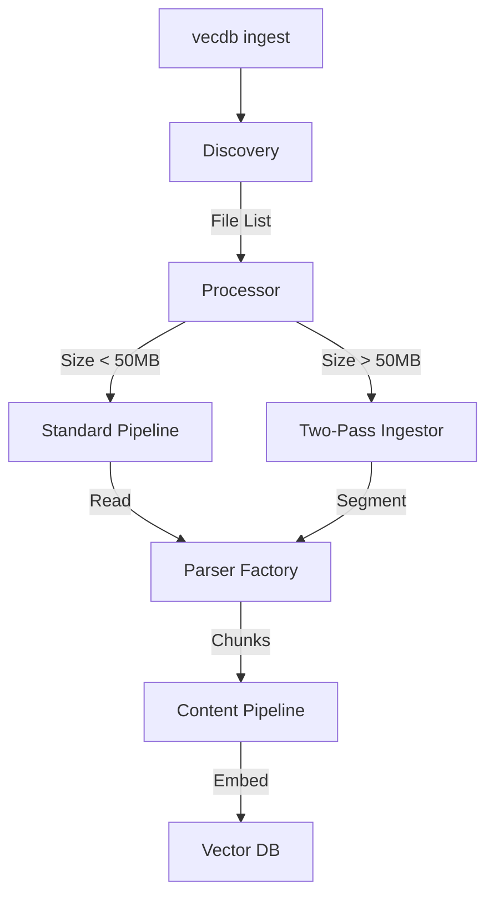

# Ingestion Design

> **Status**: Draft
> **Last Updated**: 2025-12-31
> **Type**: Design Document

---

## Overview

The ingestion pipeline is the critical path for data entering the vector database. It must be robust, efficient, and capable of handling various file formats while preserving metadata.

**Core Philosophy**: "Garbage In, Garbage Out". The quality of retrieval depends entirely on the quality of ingestion and chunking.

---

## Pipeline Architecture (Modular)

The ingestion pipeline is decoupled into specialized components within the `ingestion/` module:

### Components:
- **`discovery`**: High-performance file walking using the `ignore` crate.
- **`processor`**: Routes files to the appropriate strategy (Standard vs. Two-Pass).
- **`pipeline`**: Orchestrates parsing, chunking, and flushing.
- **`twopass`**: Handles OOM-safe segmentation and assembly of large files.

---

## 1. File Type Detection

**Strategy**: Hybrid Approach (MIME + Extension)
**Crate**: `infer`

- **Step 1**: Read first N bytes to infer MIME type.
- **Step 2**: If MIME is generic (`application/octet-stream`), check extension.
- **Step 3**: If extension unknown, attempt UTF-8 read. If valid UTF-8, treat as Text. Else, error.

---

## 2. Parsing Strategy

### PDF
- **Crate**: `pdf-extract` (libpoppler wrapper) or `lopdf` (pure Rust).
- **Decision**: Start with `lopdf` for hermeticity. If quality issues, move to `pdf-extract`.
- **Metadata Extraction**: Title, Author, Creation Date, Page Numbers.

### DOCX
- **Crate**: `docx-rs` / `dot_docx`
- **Focus**: Extract text body. Ignore complex formatting tables for MVP.

### HTML
- **Crate**: `scraper`
- **Selector**: Configurable "main content" selector (default `body`, customizable via profile).
- **Cleaning**: Remove `<script>`, `<style>`, `<nav>`, `<footer>`.

---

## 3. Chunking Strategy

**Goal**: Preserve semantic meaning.

**Algorithm**: Recursive Character Text Splitter (similar to LangChain)
1. Split by double newline `\n\n` (Paragraphs)
2. If chunk > max_size, split by single newline `\n` (Sentences)
3. If chunk > max_size, split by space ` ` (Words)

**Parameters**:
- `chunk_size`: 512 tokens (approx 2048 chars)
- `chunk_overlap`: 64 tokens (approx 256 chars)

**Metadata Preservation**:
- Each chunk inherits document metadata (Filename, Date).
- Each chunk gets positional metadata (Chunk ID, Byte Offset).

---

## 4. Embedding Generation

**Batched Processing**:
- Do not embed one by one.
- Accumulate chunks into batches (e.g., 32 chunks).
- Send batch to ONNX Runtime / Ollama.

**Model**:
- **Default**: `all-MiniLM-L6-v2` (ONNX format).
- **Reason**: Fast, reasonable quality, small footprint.

---

## 5. Upsert

**Transactions**:
- Upsert by Document ID.
- If document already exists, delete old points first (replace strategy).
- Use Qdrant `Batch` structure.

---

## Error Handling

- **Partial Failures**: If one file fails in a directory, log error and continue.
- **Corrupt Files**: Quarantine or skip.
- **Timeout**: Enforce timeouts on parsing large files.

---

## Future Optimizations

- **Parallel Parsers**: Run parsers in thread pool (`rayon`).
- **Pipeline Backpressure**: Use `tokio::sync::mpsc` channels with bounded capacity to prevent OOM if parsing is faster than embedding.
- **OCR**: Integrate `tesseract` for scanned PDFs (Phase 2).
