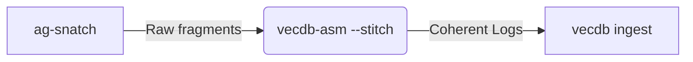
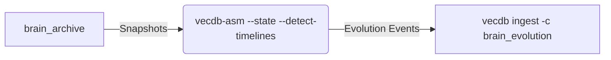

# vecdb-asm: The Knowledge Assembler

> "Entropy is the enemy. Fragmentation is the default. Assembly is the cure."

`vecdb-asm` is the high-performance assembly engine for the **Memory Compression Protocol**. It sits between raw data extraction (noisy streams, fragmented logs) and the final Vector Database. Its job is to reconstruct coherent narratives from chaos.

## core_philosophy.rs

1.  **Streams are messy**: Logs overlap, chats are fragmented, and timestamps are unreliable.
2.  **State is evolutionary**: A file isn't just its current content; it's the history of decisions that led there.
3.  **Assembly is distinct from Ingestion**: We "assemble" raw data into "Knowledge Units" *before* vectorizing them.

---

## 1. Strategies

`vecdb-asm` operates using specific **Strategies**. Currently, two strategies cover the primary domains of agent memory.

### 1.1 Stream Consolidation (`--strategy stream`)

**Problem**: You have a stream of logs or chat messages (e.g., from `ag-snatch`). The stream may contain duplicates (due to restart loops) or overlapping text fragments (due to fixed-size buffers).

**Solution**:
-   **Deduplication**: Hashes content to remove exact duplicates.
-   **Stitching**: Merges overlapping text fragments (`"Hello Wor"` + `"lo World"` -> `"Hello World"`).

**Usage**:
```bash
cat stream.jsonl | vecdb-asm --strategy stream --stitch
```

### 1.2 State Reduction & Timeline Theory (`--strategy state`)

**Problem**: You have versioned snapshots of a file (e.g., `task.md.resolved.0`...`.50`).
-   Indexing every version = **Pollution** (90% duplicate content).
-   Indexing only the last version = **Amnesia** (Lost "why" we made changes).

**Solution**: **Additive Timeline Theory**.
We treat the document history not as a simple stack of versions, but as a branching tree of narratives.

#### The "Timeline Bubble" Concept
When a document undergoes a "Massive Rewrite" (>50% deletion), `vecdb-asm` detects a timeline split.

-   **Timeline A ("Main")**: The original plan.
-   **Timeline B ("Pivot")**: The new direction after the rewrite.

This allows the agent to query: *"What was the plan before the pivot?"* without confusing it with the current state.

**Usage**:
```bash
# MUST sort input files chronologically!
vecq -t markdown --slurp $(find . -name "*.resolved.*" | sort) | \
  vecdb-asm --strategy state --detect-timelines
```

**Output Structure**:
```json
{
  "timelines": [
    { "id": "main", "reason": "Root" },
    { "id": "branch_v14", "parent_id": "main", "reason": "MassiveRewrite" }
  ],
  "events": [...]
}
```

---

## 2. The CLI & Manuals

`vecdb-asm` follows the "Big Boi Engineering" standard of self-documentation.

-   **Human Manual**: `vecdb-asm man` (Concise usage for engineers)
-   **Agent Manual**: `vecdb-asm man --agent` (Optimized context for LLMs)
-   **Help**: `vecdb-asm --help` (Flag reference)

---

## 3. Integration Patterns

### The "Snatch & Stitch" Pipeline



### The "Evolve & Index" Pipeline


